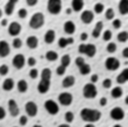
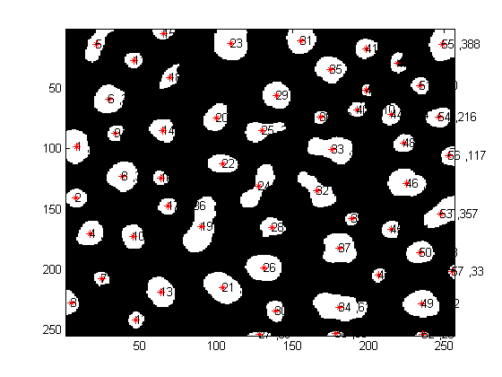

# 🧠 BinaryVision – Region Detection & Image Compression in Pure Python

BinaryVision is a Python tool that analyzes and compresses binary images using two core methods: **Otsu-based Region Detection with Blob Counting** and **Run-Length Encoding (RLE) for Image Compression**. Designed for educational insight, everything is implemented manually using only core Python.

## 🔧 Features

### 🟡 Region Analysis

- **Otsu’s Thresholding**
  - Automatically determines the best threshold to binarize grayscale images
  - Uses intra-class variance to find the optimal split between foreground and background

- **Blob Coloring**
  - Identifies distinct connected regions (cells) in the binary image
  - Assigns unique labels to each region

- **Region Statistics**
  - Filters out small blobs (area < 15 px)
  - Calculates and prints each cell’s area and centroid
  - Annotates the image with region number, area, and centroid marker

### 🔵 Image Compression

- **Run-Length Encoding (RLE)**
  - Compresses binary images by encoding runs of consecutive pixels
  - Reconstructs original binary image from encoded data

## 📂 Project Structure

```
BinaryVision/
├── compression/
│   └── run_length_encoding.py     # RLE encode/decode logic
├── region_analysis/
│   ├── binary_image.py            # Otsu thresholding, binarization
│   └── cell_counting.py           # Blob coloring and region stats
├── output/
│   ├── cellct/                    # Region analysis output
│   └── Compression/              # RLE encoded/decoded image output
├── cells.png                      # Sample input image
├── result.png                     # Sample output visualization
├── run_binaryvision.py            # Main CLI script
├── dip.py                         # Provided utility functions
├── requirements.txt
└── README.md
```

## 📸 Sample Output

| Input | Output |
|-------|--------|
|  |  |

The output image displays detected regions, each annotated with:
- An asterisk `*` marking the centroid
- Region number
- Region area

## ▶️ How to Run

```bash
# Run full region analysis pipeline
python run_binaryvision.py -i cells.png
```

Output files will be saved to:
- `output/cellct/` for region analysis (thresholded images, stats, labeled result)
- `output/Compression/` for RLE encoded/decoded outputs

---

## ✅ Tech Stack

- Python 3
- Core modules only (`math`, `os`, etc.)
- No OpenCV, NumPy, or third-party libraries

## 💡 What It Demonstrates

- Manual implementation of Otsu’s thresholding and histogram-based binarization
- Region detection using blob coloring and area filtering
- Simple image compression using run-length encoding (RLE)
- Annotating images programmatically with region metadata

